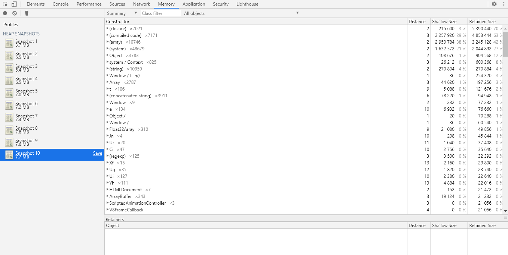
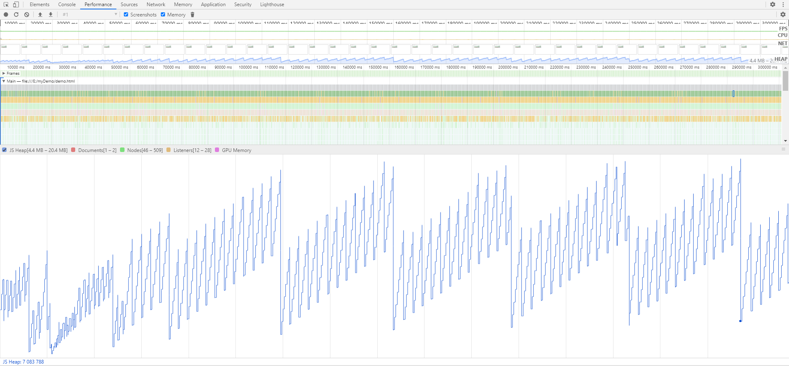

## 内存泄漏

### 一、内存泄漏

#### 1、可能导致内存泄漏的几种情况对照

| **情况**     | **定位问题的难易程度（低、中、高）**     | **处理问题的难易程度（低、中、高）** |
| ------------- |-------------|-------------|
| **Echarts频繁渲染** | 低 | 低  |
| **定时器** | 低 | 低 |
| **dom泄漏** | 中 | 中 |
| **closures(闭包)** | 高 | 高 |
| **意外的全局变量** | 中 | 低 |
| **console.log** | 低 | 低 |

> **Echarts频繁渲染**

**示例1：** Echarts图表销毁

```javascript
// demoEchartDiv 即 html中与 Echarts 绑定的 domId
var options = {......};
var demoEchartDom = document.getElementById("demoEchartDiv");
var demoEchart = echarts.getInstanceByDom(demoEchartDom);
// 此处判断图表是否存在，如果存在，则先销毁
if(demoEchart) {
    // 销毁图表
    echarts.dispose(demoEchart);
}
demoEchart = echarts.init(demoEchartDom);
demoEchart.setOption(options);
```

实际上，频繁地对Echarts图表进行销毁和渲染操作，同样可能会造成**内存泄漏**。解决办法是，**首先判断Echarts图表是否存在，如果不存在才做初始化，反之，则只对数据进行更新**。

**示例2：**

```javascript
var pieDom = document.getElementById("pieChart");
var pieChart = echarts.getInstanceByDom(pieDom);
if(!pieChart) {
    // 使用 echarts.init() 方法进行初始化
} else {
    // 使用 setOption() 方法进行数据更新
    // 假设 data 用于存放数据对象
    // 注意：setOption() 方法里的内容与图表的初始化参数有关系，可能会有差异
    pieChart.setOption({
        series: [
           {
               data: data
           }             
        ]
    });
}
```

> **定时器**

常见的情况是创建了定时器，但是没有及时销毁。

**示例1：** 每次都进行定时器的创建和销毁

```javascript
var timer;
// 创建定时器
function startTimer(){
    timer = setInterval(function(){
        initAll();
    }, 20 * 1000);
}
// 销毁定时器
function cancelTimer(){
    clearInterval(timer);
}

function initAll() {
    cancelTimer();
    startTimer();
}
```

实际上，频繁地对定时器进行销毁和创建操作，同样可能会造成**内存泄漏**。解决办法是，**将定时器创建和获取数据剥离开，只有初始化的时候才创建定时器，之后只调用获取数据的方法**。

**示例2：** 只有初始化的时候才创建定时器

```javascript
// 获取数据
function getData() {
    // ......
}

var timer;
// 创建定时器
function startTimer(){
    timer = setInterval(function(){
        getData();
    }, 20 * 1000);
}
// 销毁定时器
function cancelTimer(){
    clearInterval(timer);
}

// 初始化
function initAll() {
    cancelTimer();
    startTimer();
    getData();
}
```

> **dom泄漏**

> **closures（闭包）**

`闭包`是指有权访问**另一个函数作用域**中变量的**函数**。

**示例1：**

```javascript
function parentFunc() {
    var number = 1;
    function childFunc() {
        console.log(number);
    }
}
```

**示例2：**

```javascript
var button = document.getElementById("demoButton");
button.onclick = function() {
    console.log("hello！");
}
```


> **意外的全局变量**

> **console.log**

#### 2、内存泄漏的排查

可以使用Chrome的开发者工具进行内存泄漏的排查。

> **Memory面板**

（1）查看右下方`Total JS heap Size`的数值大小，如果有不断增加的趋势，则表明存在**内存泄漏**，需要进一步排查原因。

（2）使用 `Heap Snapshot` 进行记录并分析。

**具体操作步骤**如下：

第一步，点击左上角灰色圆圈按钮（`take heap snapshot` ）生成快照；

第二步，每间隔一段时间后，重复第一步，使其生成多个快照；

如果快照下方的值有不断增加的趋势，则表明存在**内存泄漏**，需要进一步排查原因。

**存在内存泄漏：**



> **Performance面板**

**具体操作步骤**如下：

第一步，`Screenshots`和`Memory`两个选项打勾，并点击左上角灰色圆圈按钮（`Record`），1-2分钟之后点击stop；（stop的时间可以根据实际情况进行调整）；

第二步，对生成的数据进行分析；

**存在内存泄漏：**



> **Chrome任务管理器**

查看面板中对应的`内存占用空间`、`JavaScript使用的内存`两列的值，如果有不断增加的趋势，则表明存在**内存泄漏**，需要进一步排查原因。

**推荐：**

[常见的JavaScript内存泄露](https://github.com/cucygh/js-leakage-patterns/blob/master/%E5%B8%B8%E8%A7%81%E7%9A%84JavaScript%E5%86%85%E5%AD%98%E6%B3%84%E9%9C%B2/%E5%B8%B8%E8%A7%81%E7%9A%84JavaScript%E5%86%85%E5%AD%98%E6%B3%84%E9%9C%B2.md)
