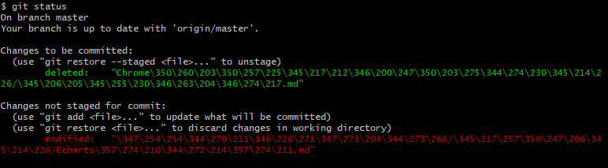
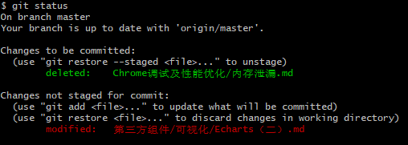
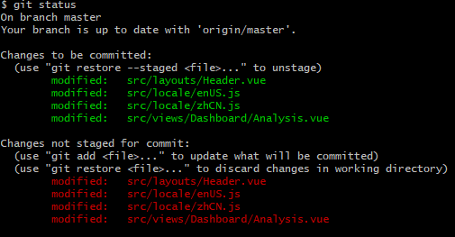

#### 1、`git add` 时提示 “Your branch is up-to-date with ‘origin/master‘”

**（1）确认是否是空文件夹；**

如果是，则需要在文件夹下面添加文件之后，再进行`git add`操作：

#### 2、`git status` 时 中文显示成一串数字



**解决方法：**

```
git config --global core.quotepath false
```



#### 3、`git push`之后未修改的文件显示`modify`,`git commit`时提示“nothing to commit, working tree clean”



**解决方法：**

```
git reset --hard
```

