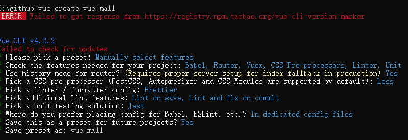

### 一、项目框架搭建

#### 1、创建项目

```
vue create vue-mall
```

基于`vue-cli4`，涉及技术包括`Babel`、`Vue-router`、`Vuex`、`CSS pre-processors（Less）`、`Linter（Prettier）`、`Unit`、`Jest`



#### 2、安装依赖

```
npm i ant-design-vue moment
```

#### 3、启动项目 

```
npm run serve
```

### 二、引入依赖

#### 1、全局引入

`main.js`

```javascript
import Antd from "ant-design-vue";
// import "ant-design-vue/dist/antd.css";
import "ant-design-vue/dist/antd.less";

Vue.use(Antd);
```

#### 2、部分引入

`main.js`

```javascript
import Button from "ant-design-vue/lib/button";
import "ant-design-vue/lib/button/style";

Vue.use(Button);
```

#### 3、`babel`按需加载

**（1）安装`babel-plugin-import`**

```
npm i babel-plugin-import --save
```

**（2）修改`babel.config.js`**

```javascript
module.exports = {
  presets: ["@vue/cli-plugin-babel/preset"],
  plugins: [
    [
      "import",
      { libraryName: "ant-design-vue", libraryDirectory: "es", style: "css" }
    ] // `style: true` 会加载 less 文件
  ]
};
```

**（3）修改部分引入**

`main.js`

```javascript
import { Button } from "ant-design-vue";

Vue.use(Button);
```

### 三、配置路由


### 四、实现布局

**推荐：**

[Ant Design Vue](https://www.antdv.com/docs/vue/introduce-cn/)