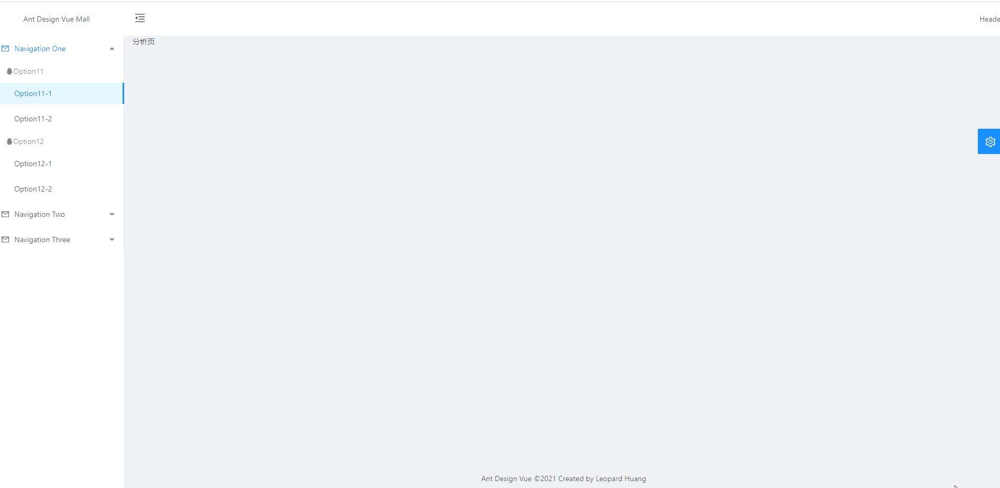

### 一、菜单展现

#### 1、拷贝菜单

菜单使用`ant-design-vue`[Menu 导航菜单](https://www.antdv.com/components/menu-cn/)里的[内嵌菜单](https://www.antdv.com/components/menu-cn/#components-menu-demo-inline-menu)

**部分代码如下：**

```SiderMenu.vue
<template>
  <div>
    <a-menu
      style="width: 256px"
      :default-selected-keys="['1']"
      :open-keys.sync="openKeys"
      mode="inline"
      :theme="theme"
      @click="handleClick"
    >
      <a-sub-menu key="sub1" @titleClick="titleClick">
        <span slot="title"
          ><a-icon type="mail" /><span>Navigation One</span></span
        >
        <a-menu-item-group key="g1">
          <template slot="title">
            <a-icon type="qq" /><span>Item 1</span>
          </template>
          <a-menu-item key="1">
            Option 1
          </a-menu-item>
          <a-menu-item key="2">
            Option 2
          </a-menu-item>
        </a-menu-item-group>
        <a-menu-item-group key="g2" title="Item 2">
          <a-menu-item key="3">
            Option 3
          </a-menu-item>
          <a-menu-item key="4">
            Option 4
          </a-menu-item>
        </a-menu-item-group>
      </a-sub-menu>
      <a-sub-menu key="sub2" @titleClick="titleClick">
        <span slot="title"
          ><a-icon type="appstore" /><span>Navigation Two</span></span
        >
        <a-menu-item key="5">
          Option 5
        </a-menu-item>
        <a-menu-item key="6">
          Option 6
        </a-menu-item>
        <a-sub-menu key="sub3" title="Submenu">
          <a-menu-item key="7">
            Option 7
          </a-menu-item>
          <a-menu-item key="8">
            Option 8
          </a-menu-item>
        </a-sub-menu>
      </a-sub-menu>
      <a-sub-menu key="sub4">
        <span slot="title"
          ><a-icon type="setting" /><span>Navigation Three</span></span
        >
        <a-menu-item key="9">
          Option 9
        </a-menu-item>
        <a-menu-item key="10">
          Option 10
        </a-menu-item>
        <a-menu-item key="11">
          Option 11
        </a-menu-item>
        <a-menu-item key="12">
          Option 12
        </a-menu-item>
      </a-sub-menu>
    </a-menu>
  </div>
</template>
```

#### 3、切换主题

**（1）参考`BasicLayout.vue`实现**

```SiderMenu.vue
<script>
export default {
  name: "SiderMenu",
  computed: {
    menuTheme() {
      return this.$route.query.navTheme || "dark";
    }
  }
}
</script>
```

**（2）通过`BasicLayout.vue`将值传递给子组件**

```BasicLayout.vue
<SiderMenu :menu-theme="navTheme"/>
```

```SiderMenu.vue
<script>
export default {
  name: "SiderMenu",
  props: {
    menuTheme: {
      type: String,
      default: "dark"
    }
  }
}
</script>
```

#### 3、修改菜单

将菜单数据赋值给某个变量，遍历显示。

**部分代码如下：**

```SiderMenu.vue
<template>
  <div>
    <a-menu
      style="width: 256px"
      :default-selected-keys="defaultSelectedKeys"
      :open-keys.sync="openKeys"
      mode="inline"
      :theme="menuTheme"
      @click="handleClick"
    >
      <a-sub-menu v-for="firstMenu in menuList" :key="firstMenu.key">
        <span slot="title"><a-icon type="mail" /><span>{{ firstMenu.title }}</span></span>
        <a-menu-item-group v-for="secondMenu in firstMenu.children" :key="secondMenu.key">
          <template slot="title">
            <a-icon type="qq" /><span>{{ secondMenu.title }}</span>
          </template>
          <a-menu-item v-for="threeMenu in secondMenu.children" :key="threeMenu.key">
            {{ threeMenu.title }}
          </a-menu-item>
        </a-menu-item-group>
      </a-sub-menu>
    </a-menu>
  </div>
</template>
<script>
export default {
  name: "SiderMenu",
  props: {
    menuTheme: {
      type: String,
      default: "dark"
    }
  },
  data() {
    return {
      // 当前展开的 key 数组  
      openKeys: [1],
      // 默认展开的 key 数组  
      defaultSelectedKeys: [111],
      menuList: [
        {
          key: 1,
          title: "Navigation One",
          children: [
            {
              key: 11,
              title: "Option11",
              children: [
                {
                  key: 111,
                  title: "Option11-1"
                },
                {
                  key: 112,
                  title: "Option11-2"
                }
              ]
            },
            {
              key: 12,
              title: "Option12",
              children: [
                {
                  key: 121,
                  title: "Option12-1"
                },
                {
                  key: 122,
                  title: "Option12-2"
                }
              ]
            }
          ]
        },
        {
          key: 2,
          title: "Navigation Two",
          children: [
            {
              key: 21,
              title: "Option21",
              children: [
                {
                  key: 211,
                  title: "Option21-1"
                },
                {
                  key: 212,
                  title: "Option21-2"
                }
              ]
            },
            {
              key: 22,
              title: "Option22",
              children: [
                {
                  key: 221,
                  title: "Option22-1"
                },
                {
                  key: 222,
                  title: "Option22-2"
                }
              ]
            }
          ]
        },
        {
          key: 3,
          title: "Navigation Three",
          children: [
            {
              key: 31,
              title: "Option31",
              children: [
                {
                  key: 311,
                  title: "Option31-1"
                },
                {
                  key: 312,
                  title: "Option31-2"
                }
              ]
            },
            {
              key: 32,
              title: "Option32",
              children: [
                {
                  key: 321,
                  title: "Option32-1"
                },
                {
                  key: 322,
                  title: "Option32-2"
                }
              ]
            }
          ]
        }
      ]
    };
  },
  watch: {
    openKeys(val) {
      console.log("openKeys", val);
    }
  },
  methods: {
    handleClick(e) {
      console.log("click", e);
    },
    titleClick(e) {
      console.log("titleClick", e);
    }
  }
};
</script>
```

**效果图：**


