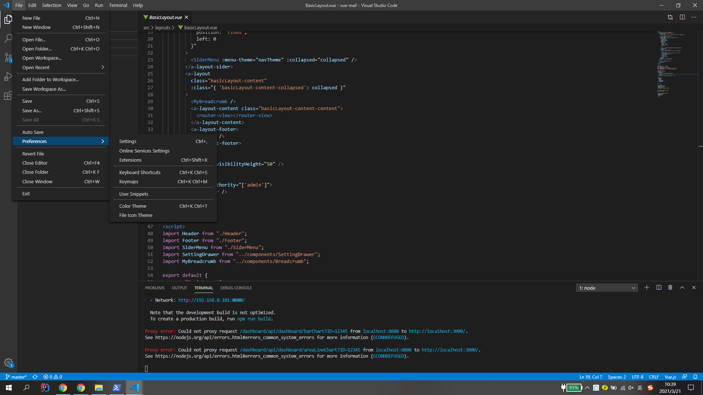
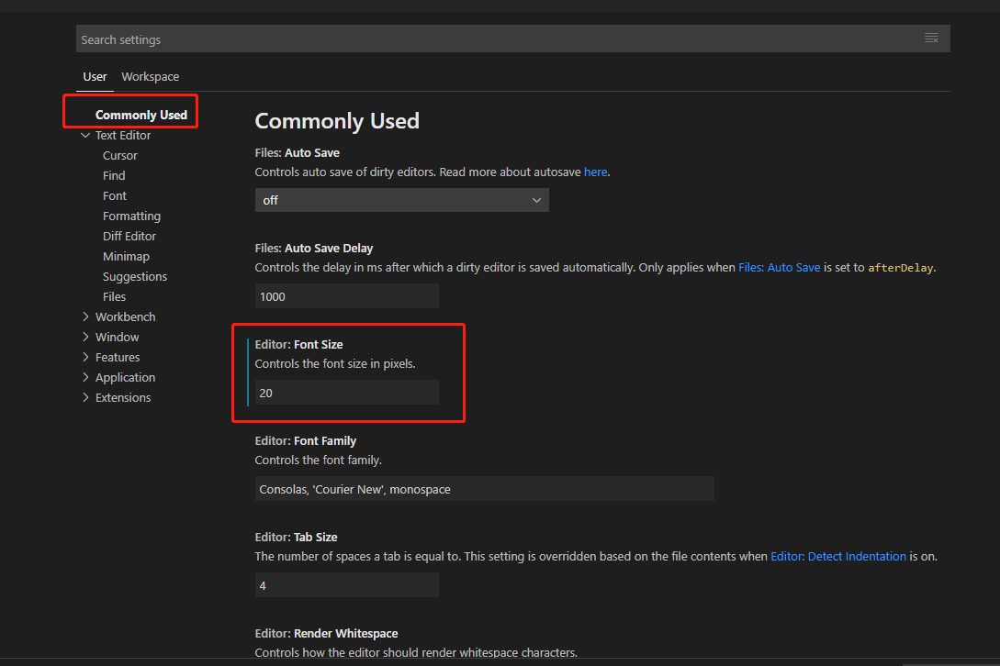
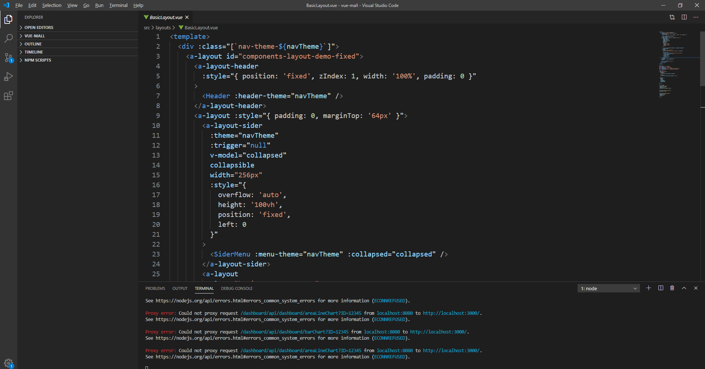
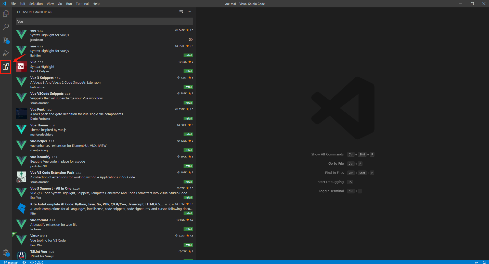
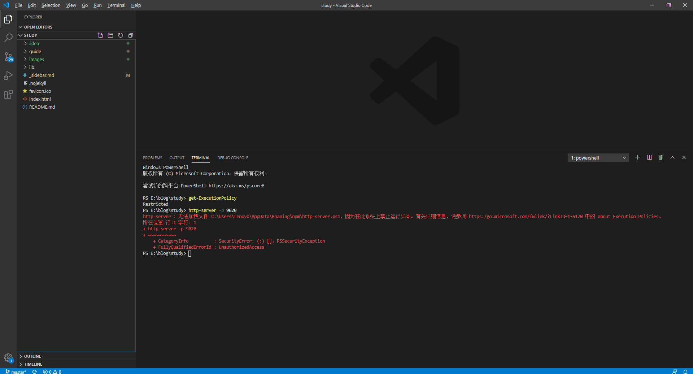
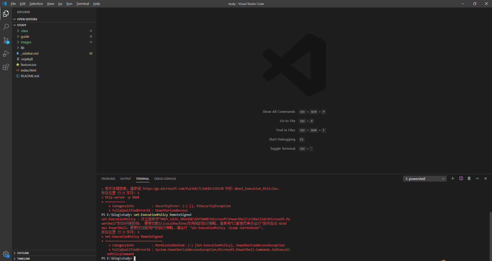
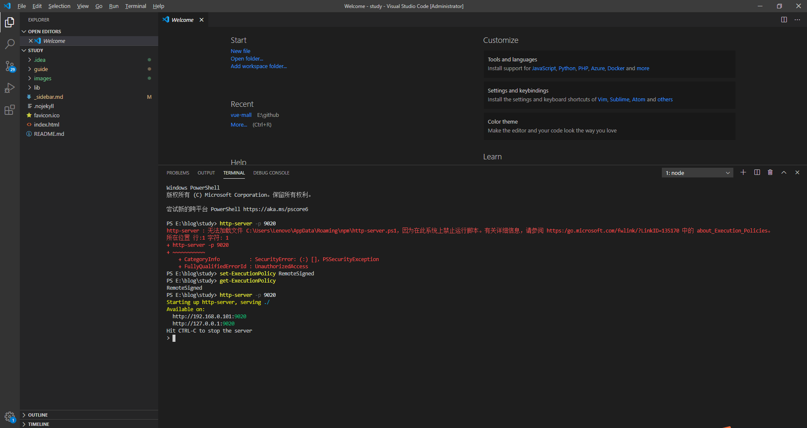

### 一、VisualStudioCode 常用快捷键

#### 1、根据文件名查找文件

ctrl-p

#### 2、根据内容查找

ctrl-shift-f

#### 3、定位到某一行

ctrl-g

#### 4、html:5 快速生成html

### 二、常用设置

#### 1、设置字体大小

#### 2、代码高亮显示

安装相应插件，如`Vue`等。

### 三、问题处理

**1、无法执行脚本**

**注意：VisualStudioCode需要以管理员身份运行**

**参考：**

[解决VSCODE 因为在此系统上禁止运行脚本 报错](https://blog.csdn.net/u013654125/article/details/106127753)