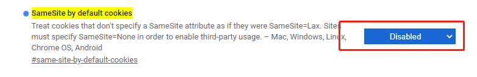

### 一、问题处理

#### 1. same-origin

**关键词：** `跨域`、`X-Frame-Options`、`same-origin`

**问题描述：**

嵌入第三方系统时，`console`控制台提示有`X-Frame-Options`设置，首先排查是否是第三方系统本身有该设置，其次检查浏览器。

**原因：**

`Chrome`升级之后，对防止跨域传送`cookie`做了设置，导致iframe无法嵌入。

**问题处理：**

访问 `chrome://flags/#same-site-by-default-cookies`，设置`SameSite by default cookies`的值为`disabled`

**参考：**

[chrome浏览器跨域Cookie的SameSite问题导致访问iframe内嵌页面异常](https://blog.csdn.net/yhyc812/article/details/108623844)

[Cookie 的 SameSite 属性](http://www.ruanyifeng.com/blog/2019/09/cookie-samesite.html)
